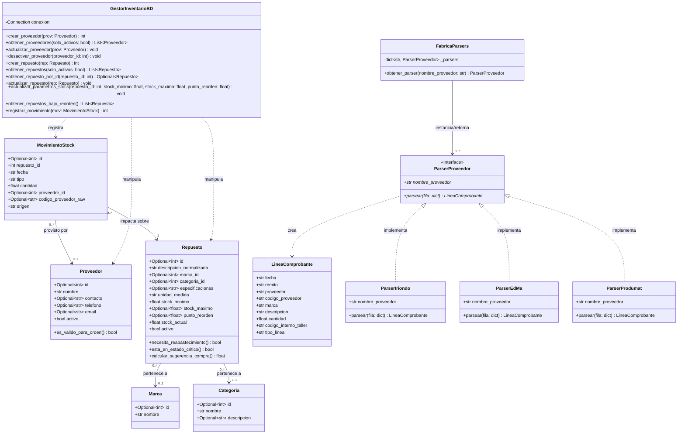

# 📐 Diagrama de Clases UML — Gestor de Inventario

```mermaid
classDiagram
    %% MODELO DE DOMINIO (ENTIDADES - dataclasses)
    class Proveedor {
        +Optional~int~ id
        +str nombre
        +Optional~str~ contacto
        +Optional~str~ telefono
        +Optional~str~ email
        +bool activo
        +es_valido_para_orden() bool
    }

    class Marca {
        +Optional~int~ id
        +str nombre
    }

    class Categoria {
        +Optional~int~ id
        +str nombre
        +Optional~str~ descripcion
    }

    class Repuesto {
        +Optional~int~ id
        +str descripcion_normalizada
        +Optional~int~ marca_id
        +Optional~int~ categoria_id
        +Optional~str~ especificaciones
        +str unidad_medida
        +float stock_minimo
        +Optional~float~ stock_maximo
        +Optional~float~ punto_reorden
        +float stock_actual
        +bool activo
        +necesita_reabastecimiento() bool
        +esta_en_estado_critico() bool
        +calcular_sugerencia_compra() float
    }

    class MovimientoStock {
        +Optional~int~ id
        +int repuesto_id
        +str fecha
        +str tipo
        +float cantidad
        +Optional~int~ proveedor_id
        +Optional~str~ codigo_proveedor_raw
        +str origen
    }

    class LineaComprobante {
        +str fecha
        +str remito
        +str proveedor
        +str codigo_proveedor
        +str marca
        +str descripcion
        +float cantidad
        +str codigo_interno_taller
        +str tipo_linea
    }

    %% CAPA DE PERSISTENCIA (CRUD / GESTOR)
    class GestorInventarioBD {
        -Connection conexion
        +crear_proveedor(prov: Proveedor) int
        +obtener_proveedores(solo_activos: bool) List~Proveedor~
        +actualizar_proveedor(prov: Proveedor) void
        +desactivar_proveedor(proveedor_id: int) void
        +crear_repuesto(rep: Repuesto) int
        +obtener_repuestos(solo_activos: bool) List~Repuesto~
        +obtener_repuesto_por_id(repuesto_id: int) Optional~Repuesto~
        +actualizar_repuesto(rep: Repuesto) void
        +actualizar_parametros_stock(repuesto_id: int, stock_minimo: float, stock_maximo: float, punto_reorden: float) void
        +obtener_repuestos_bajo_reorden() List~Repuesto~
        +registrar_movimiento(mov: MovimientoStock) int
    }

    %% PATRÓN STRATEGY / FACTORY
    class ParserProveedor {
        <<interface>>
        +str nombre_proveedor*
        +parsear(fila: dict)* LineaComprobante
    }

    class ParserIriondo {
        +str nombre_proveedor
        +parsear(fila: dict) LineaComprobante
    }

    class ParserEdMa {
        +str nombre_proveedor
        +parsear(fila: dict) LineaComprobante
    }

    class ParserProdumat {
        +str nombre_proveedor
        +parsear(fila: dict) LineaComprobante
    }

    class FabricaParsers {
        -dict~str, ParserProveedor~ _parsers
        +obtener_parser(nombre_proveedor: str) ParserProveedor
    }

    %% RELACIONES
    Repuesto "0..*" --> "0..1" Marca : pertenece a
    Repuesto "0..*" --> "0..1" Categoria : pertenece a
    MovimientoStock "0..*" --> "1" Repuesto : impacta sobre
    MovimientoStock "0..*" --> "0..1" Proveedor : provisto por

    GestorInventarioBD ..> Proveedor : manipula
    GestorInventarioBD ..> Repuesto : manipula
    GestorInventarioBD ..> MovimientoStock : registra

    ParserProveedor <|.. ParserIriondo : implementa
    ParserProveedor <|.. ParserEdMa : implementa
    ParserProveedor <|.. ParserProdumat : implementa

    FabricaParsers --> "1..*" ParserProveedor : instancia/retorna
    ParserProveedor ..> LineaComprobante : crea
```