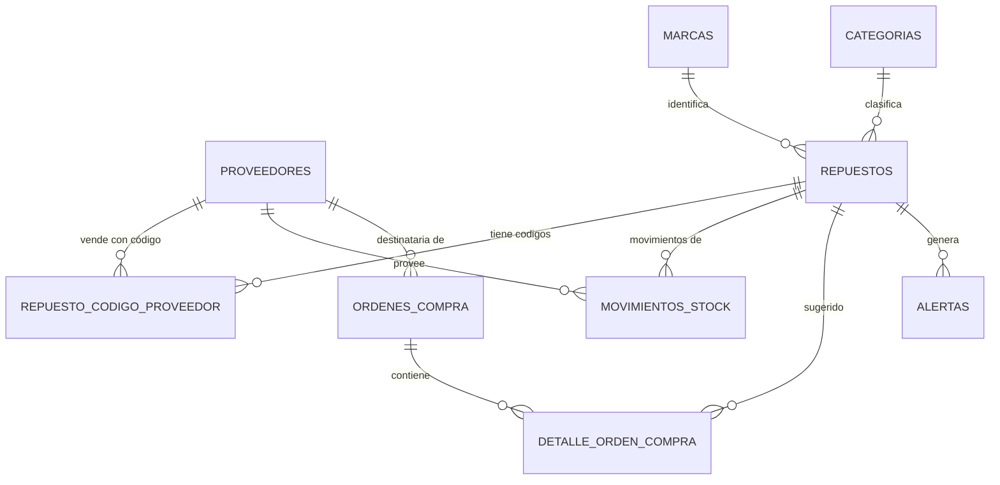

# Procesamiento de datos y modelo de tablas — Gestor de Stock

> Informe técnico de apoyo para las etapas "Digitalización, BDD y gestión de inventario" del proyecto. Basado en la inspección real de `data/base_stock_taller.xlsx` (hoja `Productos`, 252 filas, columnas `Fecha | N° Remito | Proveedor | Código | Descripción | Cantidad`).

## 1. Diagnóstico de los datos

El archivo mezcla remitos de 3 proveedores, y cada uno usa una convención distinta para `Código` y `Descripción`. Esto confirma lo que se venía observando y lo cuantifica:

| Proveedor | Filas | Formato de `Código` | Formato de `Descripción` |
|---|---|---|---|
| Rodamientos Iriondo S.R.L. | 232 | Código de fabricante ya estandarizado (ej. `32212 JR`, `K 26X40X26`, `55200CRE2/437`) | `MARCA - TIPO` (ej. `SAV - RETEN`, `ZKL - RODAMIENTO`) |
| Metalúrgica ED-MA S.R.L. | 15 | Compuesto: `código interno del taller / código de fabricante` (ej. `H-8025/1 / HF1800300000010`) | Sin marca (ED-MA es la marca); texto libre con tipo + especificaciones + medidas en pulgadas (ej. `HORQ K518 F DOBLE BUL 1 3/8" Z21`) |
| Produmat S.A. | 5 | Código propio numérico (ej. `2110300430`) | Sin marca (Produmat es la marca); texto libre con tipo + medidas (ej. `TUBO TR D 44.7 X 3.9 -518 INT- X 6000`) |

Hallazgo cuantificado sobre los códigos "no producto": dentro de Iriondo hay **39 filas (16,8% de sus renglones)** que no son repuestos sino cargos administrativos del propio proveedor, identificables porque `Descripción` empieza con el prefijo `I.A` (no es una marca de rodamiento, es "Iriondo Administración" o similar):

- `Código = 000247MARCELITO`, `Descripción = I.A - Empaq/Embalaje` → 20 filas (packaging/flete). Una de ellas trae la nota del OCR *"cant. no legible, asumido"*, es decir que la cantidad fue estimada al digitalizar — dato a tener en cuenta para auditoría.
- `Código = 0007-SEGURO`, `Descripción = I.A - SEG. MERCADERIA` → 19 filas (seguro de mercadería).

Estas filas aparecen repetidas en casi todos los remitos de Iriondo (un cargo fijo por envío), y como el alcance del proyecto excluye explícitamente el procesamiento de precios, **no aportan nada al control de stock ni a la predicción de demanda**: hay que excluirlas del modelo de repuestos, pero conviene no borrarlas sin más — quedan mejor preservadas en una tabla de detalle crudo con un flag de tipo de línea, para trazabilidad y para poder auditar el archivo fuente si hace falta.

Otras observaciones:
- No hay valores nulos en ninguna columna.
- `Cantidad` ya es numérica.
- Las marcas detectadas en Iriondo (excluyendo `I.A`): `ZKL, SAV, GKL, NTN, ETM, KOY, FAG, CHO, INA, DBH`.
- El mismo tipo de pieza se abrevia distinto según proveedor: ED-MA escribe `HORQ` (horquilla) y Produmat escribe `HOR` para lo mismo. Esto significa que **no conviene clasificar por texto literal**; hace falta un diccionario de normalización tipo→categoría mantenido a mano y ampliado a medida que entran más remitos.

## 2. Estrategia de procesamiento

Idea central: separar **ingesta cruda** (fiel al archivo/OCR, para trazabilidad) de **normalización a un modelo canónico** de repuesto. Como cada proveedor tiene su propia convención y en el futuro entrarán más remitos con el mismo problema, conviene resolverlo con un parser por proveedor en vez de reglas ad-hoc dispersas — encaja bien con Programación Orientada a Objetos usando un **patrón Strategy**: una interfaz común `ParserProveedor.parsear(fila) -> LineaNormalizada`, con una implementación por proveedor.

Pasos del pipeline:

1. **Carga cruda**: leer el Excel/CSV tal cual a una tabla de staging (`comprobantes` + `detalle_comprobante`), sin transformar nada todavía.
2. **Clasificar tipo de línea**: `PRODUCTO` vs `CARGO_ADMINISTRATIVO`. Regla actual: si `Proveedor == Iriondo` y `Descripción` empieza con `I.A`, es cargo administrativo. Conviene mantener esta regla como una tabla/lista configurable de patrones conocidos (por proveedor), no como un `if` hardcodeado, porque otros proveedores podrían traer sus propios cargos de flete/seguro con otro prefijo.
3. **Parsear filas `PRODUCTO`** con el parser del proveedor correspondiente:
   - **`ParserIriondo`**: separa `Descripción` por `" - "` → `(marca, tipo)`. El `Código` se conserva tal cual (ya es un identificador de fabricante razonablemente único).
   - **`ParserEdMa`**: separa `Código` por `" / "` → `(codigo_interno_taller, codigo_fabricante)`. `marca` fija = `"ED-MA"`. `Descripción` completa se guarda como texto libre en esta etapa (separar medidas/roscas de forma confiable requiere reglas regex por familia de pieza — mejor iterarlo después con más datos, no bloquear la entrega).
   - **`ParserProdumat`**: `Código` tal cual, `marca` fija = `"Produmat"`, `Descripción` como texto libre.
4. **Resolver identidad del repuesto**: agrupar por `(proveedor, código_proveedor)`. Cada combinación distinta es, por ahora, un repuesto distinto. Si en el futuro se detecta que dos proveedores venden la misma pieza física, se resuelve agregando una fila en la tabla puente `repuesto_codigo_proveedor` sin tener que reprocesar todo el histórico.
5. **Cargar a SQLite** según el esquema de la sección 3, dejando las filas `CARGO_ADMINISTRATIVO` con `repuesto_id = NULL` (visibles para auditoría, invisibles para stock/predicción).

Boceto de la clasificación y el parseo en Python (pandas), pensado para vivir en `modules/` como lógica de dominio reutilizable desde `apps/`:

```python
from abc import ABC, abstractmethod
from dataclasses import dataclass

@dataclass
class LineaNormalizada:
    proveedor: str
    codigo_proveedor: str
    codigo_interno_taller: str | None
    marca: str
    descripcion: str
    cantidad: float
    tipo_linea: str  # "PRODUCTO" | "CARGO_ADMINISTRATIVO"

CARGOS_CONOCIDOS = {
    # (proveedor, código) -> lo que representa, para no perderlo al excluirlo
    ("Rodamientos Iriondo S.R.L.", "000247MARCELITO"): "Embalaje/flete",
    ("Rodamientos Iriondo S.R.L.", "0007-SEGURO"): "Seguro de mercadería",
}

class ParserProveedor(ABC):
    @abstractmethod
    def parsear(self, fila) -> LineaNormalizada: ...

class ParserIriondo(ParserProveedor):
    def parsear(self, fila):
        clave = (fila["Proveedor"], fila["Código"])
        if clave in CARGOS_CONOCIDOS:
            return LineaNormalizada(fila["Proveedor"], fila["Código"], None,
                                     "I.A", fila["Descripción"], fila["Cantidad"],
                                     "CARGO_ADMINISTRATIVO")
        marca, _, tipo = fila["Descripción"].partition(" - ")
        return LineaNormalizada(fila["Proveedor"], fila["Código"], None,
                                 marca.strip(), tipo.strip(), fila["Cantidad"],
                                 "PRODUCTO")

class ParserEdMa(ParserProveedor):
    def parsear(self, fila):
        interno, _, fabricante = fila["Código"].partition(" / ")
        return LineaNormalizada(fila["Proveedor"], fabricante.strip(), interno.strip(),
                                 "ED-MA", fila["Descripción"].strip(), fila["Cantidad"],
                                 "PRODUCTO")

class ParserProdumat(ParserProveedor):
    def parsear(self, fila):
        return LineaNormalizada(fila["Proveedor"], fila["Código"], None,
                                 "Produmat", fila["Descripción"].strip(), fila["Cantidad"],
                                 "PRODUCTO")

PARSERS = {
    "Rodamientos Iriondo S.R.L.": ParserIriondo(),
    "Metalúrgica ED-MA S.R.L.": ParserEdMa(),
    "Produmat S.A.": ParserProdumat(),
}
```

## 3. Esquema de tablas propuesto (SQLite, relacional)

Diseño normalizado (evita repetir marca/proveedor/categoría en cada fila) y separa explícitamente lo que es stock de lo que no lo es. No incluye precios/costos porque el alcance del proyecto los excluye explícitamente.

> **Actualización:** esta sección se simplificó — se sacaron `comprobantes` y `detalle_comprobante`. El equipo definió que no se va a trackear información de remitos más allá de la carga inicial (ver sección 5), así que esa cabecera no tiene lugar en el esquema permanente. `movimientos_stock` pasa a ser la única tabla de hechos, con su propio `proveedor_id` para no perder la trazabilidad de "a quién le compramos" sin necesitar un remito.



**Tablas núcleo (resuelven el problema de esta etapa):**

- `proveedores(id PK, nombre UNIQUE, contacto, telefono, email)` — RF02.
- `marcas(id PK, nombre UNIQUE)` — incluye marcas de terceros (ZKL, SAV, NTN, ...) y las marcas propias de fabricantes-proveedores (ED-MA, Produmat), para que la columna sea consistente en toda la tabla `repuestos`.
- `categorias(id PK, nombre UNIQUE, descripcion)` — Rodamiento, Retén, Horquilla, Buje, Cadena, Disco dentado, Tubo, Resorte, etc. Se completa/ajusta a mano; no depender del texto literal de cada proveedor (ver ejemplo `HORQ` vs `HOR`).
- `repuestos(id PK, descripcion_normalizada, marca_id FK, categoria_id FK, especificaciones TEXT, unidad_medida, stock_minimo, stock_maximo, punto_reorden, stock_actual)` — la entidad canónica que pide RF01/RF03.
- `repuesto_codigo_proveedor(id PK, repuesto_id FK, proveedor_id FK, codigo_proveedor, codigo_interno_taller NULL, UNIQUE(proveedor_id, codigo_proveedor))` — resuelve el núcleo del problema: el mismo repuesto puede tener códigos distintos según quién lo vendió, y el mismo proveedor puede tener más de un código para la misma pieza (caso ED-MA).
- `movimientos_stock(id PK, repuesto_id FK, proveedor_id FK NULL, fecha, tipo CHECK IN ('INGRESO','EGRESO','AJUSTE'), cantidad, codigo_proveedor_raw NULL, origen CHECK IN ('carga_inicial','manual'))` — **tabla de hechos**: un renglón por cada movimiento, sin cabecera de remito. Es la fuente de la serie de tiempo para el módulo predictivo (RF04) y de la frecuencia de compra por proveedor. `stock_actual` en `repuestos` se cachea a partir de acá y nunca se edita a mano. `proveedor_id` solo se completa en `INGRESO`; `codigo_proveedor_raw` es trazabilidad opcional que solo lleva la carga histórica.

**Tablas de soporte para el resto del alcance:**

- `usuarios(id PK, username UNIQUE, password_hash, recordar_sesion, ultimo_dispositivo)` — RF06/RF07/RNF02-04.
- `ordenes_compra(id PK, fecha, proveedor_id FK, estado, archivo_txt)` + `detalle_orden_compra(id PK, orden_id FK, repuesto_id FK, cantidad_sugerida)` — RF05, exportación a `.txt`.
- `alertas(id PK, repuesto_id FK, fecha, tipo, mensaje, atendida BOOLEAN)` — RF05.

DDL de las tablas núcleo, listo para adaptar:

```sql
CREATE TABLE proveedores (
    id INTEGER PRIMARY KEY,
    nombre TEXT NOT NULL UNIQUE,
    contacto TEXT, telefono TEXT, email TEXT
);

CREATE TABLE marcas (
    id INTEGER PRIMARY KEY,
    nombre TEXT NOT NULL UNIQUE
);

CREATE TABLE categorias (
    id INTEGER PRIMARY KEY,
    nombre TEXT NOT NULL UNIQUE,
    descripcion TEXT
);

CREATE TABLE repuestos (
    id INTEGER PRIMARY KEY,
    descripcion_normalizada TEXT NOT NULL,
    marca_id INTEGER REFERENCES marcas(id),
    categoria_id INTEGER REFERENCES categorias(id),
    especificaciones TEXT,
    unidad_medida TEXT DEFAULT 'unidad',
    stock_minimo REAL DEFAULT 0,
    stock_maximo REAL,
    punto_reorden REAL,
    stock_actual REAL DEFAULT 0
);

CREATE TABLE repuesto_codigo_proveedor (
    id INTEGER PRIMARY KEY,
    repuesto_id INTEGER NOT NULL REFERENCES repuestos(id),
    proveedor_id INTEGER NOT NULL REFERENCES proveedores(id),
    codigo_proveedor TEXT NOT NULL,
    codigo_interno_taller TEXT,
    UNIQUE(proveedor_id, codigo_proveedor)
);

CREATE TABLE movimientos_stock (
    id INTEGER PRIMARY KEY,
    repuesto_id INTEGER NOT NULL REFERENCES repuestos(id),
    proveedor_id INTEGER REFERENCES proveedores(id),
    fecha DATE NOT NULL,
    tipo TEXT NOT NULL CHECK (tipo IN ('INGRESO','EGRESO','AJUSTE')),
    cantidad REAL NOT NULL,
    codigo_proveedor_raw TEXT,
    origen TEXT NOT NULL DEFAULT 'manual' CHECK (origen IN ('carga_inicial','manual'))
);
```

## 4. Notas para las próximas iteraciones

- La separación de medidas/especificaciones (pulgadas, roscas, códigos `Z6`/`Z21`, etc.) dentro de `Descripción` de ED-MA y Produmat se dejó como texto libre en `especificaciones`. Si el módulo predictivo o los informes necesitan filtrar por medida, conviene resolverlo con reglas regex específicas por categoría cuando haya más volumen de datos — no vale la pena generalizarlo con solo 20 filas.
- El diccionario de normalización de categorías (`HORQ` = `HOR` = "Horquilla", etc.) conviene mantenerlo como una tabla chica editable a mano (`categorias` + un mapeo de sinónimos), no como reglas de código, porque van a seguir apareciendo abreviaturas nuevas con cada proveedor.
- Este dataset (`Fecha, N° Remito, Proveedor, Código, Descripción, Cantidad`) son **ingresos de mercadería** (remitos de compra), no necesariamente "consumo". Si el objetivo del planteo original habla de "anotaciones de consumo" como fuente separada, conviene confirmar si esas notas ya están digitalizadas o si por ahora el modelo predictivo va a aproximar demanda con la frecuencia de compra como proxy.

## 5. Decisión: carga inicial con el histórico + carga manual en adelante

**Decisión tomada por el equipo (Camila y Lucía):** hacer una única carga inicial con `base_stock_taller.xlsx` (usando el pipeline de la sección 2) y que, de ahí en más, los datos se carguen a mano a través del sistema.

Es la decisión correcta para el alcance de este proyecto, por dos motivos concretos:

- El propio planteo excluye explícitamente "Procesamiento automático mediante OCR para lectura directa de imágenes de facturas" de lo que el sistema *no* incluye. El OCR fue un paso que ustedes hicieron una vez, a mano, para digitalizar el papel — no es una funcionalidad que el sistema tenga que sostener. Construir un pipeline de ingesta recurrente sería trabajo extra fuera de lo pedido.
- La carga manual ya es un requisito funcional aparte (RF01: crear/consultar/modificar/clasificar repuestos e insumos), así que no es esfuerzo adicional: es la misma pantalla CRUD que van a tener que construir de todos modos.

Tres cosas para no perder de vista al implementarlo:

1. **La carga inicial no debería ser un script que alguien corre una sola vez a mano y se olvida.** El `data/README.md` del propio repo es explícito: si la base SQLite no se trackea en git, el sistema debe detectar que no existe y poblarla automáticamente con los datos mínimos al arrancar. Conviene entonces que el pipeline de la sección 2 viva como una rutina de inicialización (ej. `modules/inicializacion.py`, invocada desde `apps/` al detectar que `stock.sqlite3` no existe) que lee `data/base_stock_taller.xlsx` y siembra la base, en vez de un script suelto documentado aparte. Así cualquiera que clone el repo (incluida la corrección) levanta el sistema ya poblado sin pasos manuales.
2. **Antes de que la carga inicial se considere "definitiva", conviene una revisión humana de lo que el OCR asumió.** Ya encontramos un caso (`"cant. no legible, asumido"`); puede haber más errores de lectura silenciosos que no se auto-declaran así. Una pasada de revisión (aunque sea manual, comparando contra los comprobantes en papel de los casos dudosos) antes de dar por buena la base evita que un error de OCR quede enterrado como si fuera un dato real.
3. **La carga manual hacia adelante tiene que registrar también los egresos/consumo, no solo lo que entra.** El histórico que tienen son remitos de compra (ingresos). Si de acá en más solo cargan compras nuevas y nunca el consumo real del taller, `stock_actual` va a quedar mal (nunca baja) y el módulo predictivo (RF04) se va a quedar sin la señal de consumo que necesita. Vale la pena que la pantalla de "Actualización de stock" del usuario final (que ya está en el caso de uso) contemple explícitamente registrar salidas de repuestos, no solo altas por compra — aunque sea como ajuste manual sin el detalle de una factura.

Además, como la carga es manual de acá en más, conviene que el formulario fuerce la estructura que ya definimos en el esquema (sección 3) en vez de dejar campos de texto libre: elegir proveedor y marca de una lista (o darlos de alta si son nuevos), elegir categoría, y — el punto más importante — si están cargando un repuesto que ya existe pero comprado a un proveedor nuevo, buscarlo primero en `repuestos` y agregar sólo una fila nueva en `repuesto_codigo_proveedor`, en vez de crear un repuesto duplicado. Si no, con el tiempo la carga manual va a reproducir exactamente el mismo quilombo de códigos que tuvimos que resolver ahora con el Excel.

## 6. ¿Dimensiones lentamente cambiantes (SCD) tipo 2 para registrar los movimientos?

**No, para los movimientos en sí no es la herramienta correcta.** SCD tipo 2 es una técnica de modelado dimensional para versionar los **atributos de una dimensión** en el tiempo: guarda una fila nueva con `valido_desde`/`valido_hasta` (y un flag de "vigente") cada vez que cambia un atributo, para poder responder "¿qué categoría tenía este repuesto en marzo?". Está pensada para atributos que **permanecen válidos durante un intervalo** hasta que se los reemplaza (una dirección, una categoría, un precio de lista).

Un movimiento de stock no es eso: es un **evento puntual e inmutable** (el 10/09 entraron 5 unidades), no un atributo que "está vigente" hasta que cambia. Lo que corresponde para eventos de este tipo es lo que ya tienen en `movimientos_stock`: una **tabla de hechos** (fact table) donde cada fila es un movimiento con su fecha, que nunca se actualiza ni se versiona, solo se inserta. Esa es exactamente la fuente que necesita el módulo predictivo (RF04) para construir la serie de tiempo: agrupar `movimientos_stock` por `repuesto_id` y `fecha` ya da la serie de consumo/reposición sin ninguna maquinaria de SCD.

Dicho esto, la intuición de "necesitamos versionar algo" no está mal apuntada, solo mal aplicada al objeto: donde SCD tipo 2 **sí sería apropiado** es en los atributos de `repuestos` y `proveedores` que pueden cambiar con el tiempo y de los que después importa saber el valor histórico — por ejemplo, si cambian `stock_minimo`/`stock_maximo`/`punto_reorden` de un repuesto, o los datos de contacto de un proveedor. De hecho, el propio planteo del proyecto marca a RF02 (proveedores) y RF03 (stock y parámetros) como "requisitos cambiantes o extensibles", así que no es una idea descabellada.

Para el alcance de estas 5 semanas, mi sugerencia es **no implementarlo todavía**: ninguno de los RF01-RF05 pide consultar el valor histórico de un parámetro en una fecha pasada, así que sería complejidad extra sin un caso de uso que la necesite hoy. Si más adelante lo necesitan, es un cambio acotado (agregar `valido_desde`/`valido_hasta`/`vigente` a `repuestos` o `proveedores` y dejar de hacer `UPDATE` in-place sobre esas filas) que no obliga a tocar `movimientos_stock`. Si prefieren tenerlo desde ahora igual, decime y lo sumamos.

## 7. Remitos: solo en la carga inicial, no en el esquema permanente

Ya se sacaron `comprobantes` y `detalle_comprobante` del esquema (sección 3): no se va a cargar información de remitos de forma continua, así que no tiene sentido mantener esa cabecera como tabla permanente. `movimientos_stock` quedó como la única tabla de hechos, con su propio `proveedor_id` (para no perder de vista a quién se le compró cada ingreso, que hace falta para el objetivo de "evaluación de proveedores") y un `codigo_proveedor_raw` opcional que solo completa la carga histórica, a modo de trazabilidad liviana sin necesitar una cabecera de remito. Los cargos administrativos (flete, seguro) directamente no se guardan: se descartan en el parseo, y el Excel original en `data/` queda como respaldo si hace falta auditarlos.
